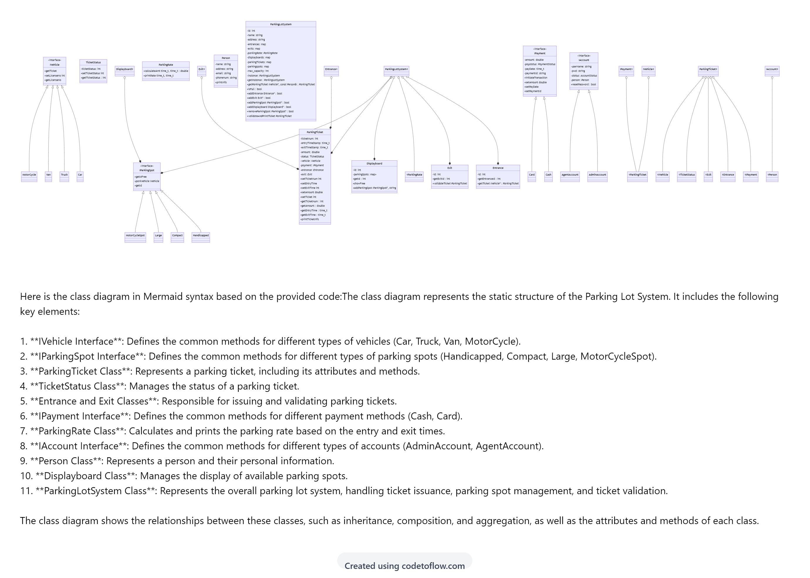

# DesignProblems1_ParkingLotSystem
### ClassDiagram of PrankingLotSystem 
* **Image of class Diagram**,

### The solution contains the three different files
* ParkingLotSystem.h
  - It contains the all the Interface classes , classes which inherits the interface class , independent classes.
* AdminAccount.cpp
   - It contains the methods of AdminAccount like addParkingSpot, removeParkingSpot, addEntrance, addExit, addDisplayboard .
* client.cpp
  - Here client interact with the ParkingLotSystem interface .
  - The ParkingLotSystem is implemented on Singleton design pattern where the all the interaction  take place at a single interface.
